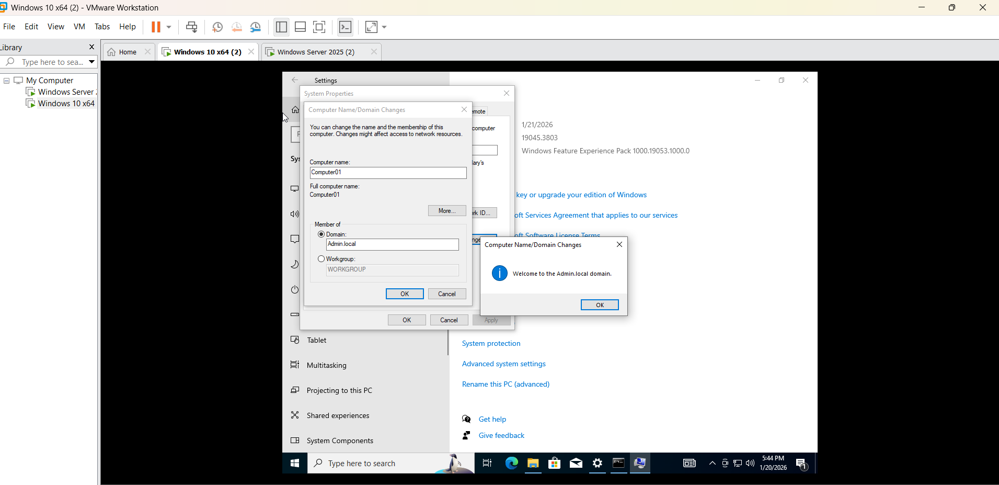

# Active Directory Lab Setup (Windows Server + Windows 10)

## Overview
As part of my hands-on learning during my internship at **Sui Southern Gas Company Limited (SSGC)**, I built a complete **Active Directory lab environment** using **VMware Workstation**.  
This project demonstrates how user accounts, computers, and access are centrally managed in a domain-based network.

This repository documents the **process, structure, and learning outcomes** of the lab.  
(No virtual machine or ISO files are included.)

---

## Lab Objectives
- Configure a **Domain Controller** with a static IP
- Install and configure **Active Directory Domain Services (AD DS)**
- Create **Organizational Units (OUs)** for users and computers
- Create and manage **domain user accounts**
- Set up a **Windows 10 client machine**
- Successfully **join the client machine to the domain**

---

## Tools & Technologies Used
- **Windows Server**
- **Windows 10 (Client)**
- **VMware Workstation**
- **Active Directory Domain Services (AD DS)**
- **DNS**
- **Virtual Networking**

---

## Lab Architecture
- One Windows Server acting as a **Domain Controller**
- One Windows 10 machine acting as a **domain-joined client**
- Centralized authentication and user management using Active Directory

---

## Key Configuration Steps
1. Installed Windows Server on a virtual machine
2. Assigned a **static IP address** to the Domain Controller
3. Installed **Active Directory Domain Services**
4. Promoted the server to a **Domain Controller**
5. Created **Organizational Units (OUs)** for structured management
6. Created domain users and managed permissions
7. Installed Windows 10 on a client VM
8. Joined the Windows 10 client to the domain successfully

---

## Screenshot Evidence

### Internship Lab Setup
The following screenshot shows the internship-based Active Directory lab configuration and setup:

---

## Learning Outcomes
- Clear understanding of **what a domain is** and why it is used
- Practical experience with **centralized user and computer management**
- Hands-on exposure to **real-world system administration workflows**
- Improved understanding of **network identity and access control**
- Confidence in setting up and managing a basic enterprise IT environment

---

## Notes
- This project is created **for learning and demonstration purposes only**
- No sensitive data, VM files, or ISO images are included
- Configuration choices are simplified for lab use

---

**Rahat e Batool**  
Internship Learning Project – System Administration / Active Directory
